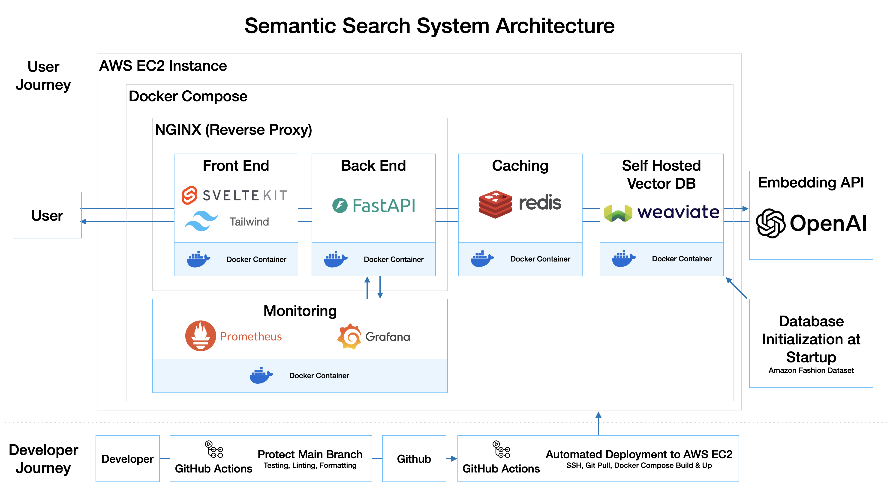

# Semantic Search Microservice

This repository implements a scalable and modular semantic search microservice for an e-commerce fashion catalog. Built to enable human-like search queries (e.g., "outfit for a beach vacation") rather than traditional keyword-only searches.

---

## Live Deployment

- **Frontend**: [Live UI](http://ec2-3-25-72-5.ap-southeast-2.compute.amazonaws.com/)
  - Use the Search button to search by "vector", "keyword", or "hybrid" methods.
- **Backend**: [Swagger UI](http://ec2-3-25-72-5.ap-southeast-2.compute.amazonaws.com:8000/docs)
  - Explore the `/search` endpoint for all search modes.

> **Note:** Backend APIs are temporarily public for evaluation purposes.

---

## Repository

- GitHub: [semantic-search](https://github.com/danyelkoca/semantic-search)

---

## Architecture



Components:

- **FastAPI**: Python backend API
- **SvelteKit**: Frontend UI
- **Weaviate**: Vector database for semantic search
- **Redis**: Caching layer
- **Docker Compose**: Local orchestration
- **CI/CD**: Automated deployment to AWS EC2

---

## API Endpoints

The microservice offers several endpoints for enhanced functionality:

| Endpoint                   | Method | Description                                            |
| -------------------------- | ------ | ------------------------------------------------------ |
| `/search`                | GET    | Main endpoint for semantic, hybrid, or keyword search. |
| `/products/{product_id}` | GET    | Specific product lookup by ID.                         |
| `/metrics`               | GET    | Exposes service metrics (Prometheus format).           |
| `/best-sellers`          | GET    | Returns a curated list of best-selling products.       |
| `/trending`              | GET    | Returns a curated list of trending products.           |
| `/health`                | GET    | Health check endpoint for the service.                 |

### `/search` Endpoint

**Parameters:**

| Name           | Type   | Required | Default  | Description                                                          |
| -------------- | ------ | -------- | -------- | -------------------------------------------------------------------- |
| `query`      | string | No       | ""       | Search query in natural language.                                    |
| `query_type` | string | No       | "vector" | `"vector"`, `"keyword"`, or `"hybrid"` search types supported. |

**Example:**

```bash
curl -X 'GET' \
  'http://localhost:8000/search?query=outfit%20for%20summer&query_type=hybrid' \
  -H 'accept: application/json'
```

**Response Example (shortened):**

```json
{
  "ok": true,
  "products": [
    {
      "title": "Floerns Women's Two Piece Outfit",
      "price": 38.99,
      "average_rating": 3.7,
      "rating_number": 1502
    },
    ...
  ]
}
```

---

## Search Modes

The system supports three search types:

- **Vector**: Semantic search using embeddings
- **Keyword**: Traditional BM25 keyword search
- **Hybrid**: Combination of vector + keyword scores

The search type is configurable via query parameters.

---

## User Access

Access the frontend UI or explore APIs via Swagger at `/docs`, both available through the public AWS EC2 instance.

---

## Setup (Local)

**Requirements:**

- [Docker Desktop](https://www.docker.com/products/docker-desktop/) (includes Docker and Docker Compose)
- [Git](https://git-scm.com/) (to clone the repository)
- Internet connection (to pull Docker images)

**Steps:**

```bash
git clone https://github.com/danyelkoca/semantic-search.git
cd semantic-search
# If you downloaded the project as a ZIP file instead of cloning via Git, skip the 'git clone' step.
# Just unzip and navigate into the extracted folder (e.g., 'semantic-search' or 'semantic-search-main').
cp .env.example .env  # Create your local environment file
```

- Open `.env` and **replace** `YOUR_OPENAI_API_KEY` with your actual OpenAI API Key.
- Then start the application:

```bash
docker-compose up --build
```

**Important Note:**

- When you first launch the application, the backend will initialize the database by inserting 1,000 products into Weaviate.
- During this process, you will see messages like:

  ```
  backend     | {"timestamp": "...", "level": "INFO", "message": "Inserted 100/1000 products (10.0%) so far...", "logger": "semantic-search"}
  ```
- Once ingestion is complete, you will see:

  ```
  backend     | {"timestamp": "...", "level": "INFO", "message": "✅ Finished ingestion. Total products inserted: 1000", "logger": "semantic-search"}
  ```
- **Please wait until ingestion is fully completed before using the frontend.**

Then open [http://localhost](http://localhost) in your browser.

Example test query:

- Query: `outfit for beach vacation`
- Mode: `vector`

## Key Design Decisions

| Component          | Choice           | Reason                            |
| ------------------ | ---------------- | --------------------------------- |
| Search Engine      | Weaviate         | Scalable vector and hybrid search |
| Backend Framework  | FastAPI          | Lightweight and fast              |
| Frontend Framework | SvelteKit        | Modern frontend with SEO support  |
| Cache Layer        | Redis            | Improve search performance        |
| Infrastructure     | Docker + AWS EC2 | Easy deployment and scaling       |

---

## Exploratory Data Analysis (EDA)

[View Full EDA Notebook](http://ec2-3-25-72-5.ap-southeast-2.compute.amazonaws.com/explore)

- Dataset: ~826K fashion products with 14 fields.
- Dropped: `bought_together`, `videos`, `main_category`, `categories`, `parent_asin` (mostly null).
- Images: Retained only MAIN image; stripped URL prefixes.
- Text: Flattened `description`, `features`, and `details` into a single searchable field.
- Price: Available for ~6% of products.
- Ratings: Included; distribution highly skewed.
- Token count: ~83M tokens; embedding estimated cost ~$1.68.
- Final selection: Top 1,000 products with price and ratings populated.

## Additional Notes

- Automatic database initialization (`backend/app/init_db.py`) with 1,000 top products.
- Embeddings: OpenAI `text-embedding-3-small` model.
- Redis caching to improve performance on trending/best-seller queries.
- Strict input validation and standardized API response formats.
- Implemented CI/CD for automatic build and deployment to AWS EC2 using GitHub Actions.
- Docker Compose orchestrates the local environment with FastAPI, SvelteKit, Redis, Weaviate, Prometheus, and Grafana.

## Next Steps

- Extend backend test coverage, including deeper mocking of Redis and Weaviate dependencies.
- Enhance frontend tests for better UI and UX validation.
- Implement user authentication.
- Add monitoring alerts based on Prometheus/Grafana metrics.
- Extend MLOps pipeline: collect user interactions (clicks, purchases) to evaluate and retrain recommendation models.
- Explore evaluation metrics (e.g., recall@k, precision@k) to measure search and recommendation quality.
- Conduct experiments to compare **hybrid**, **keyword**, and **vector** search effectiveness based on user behavior and offline metrics.
